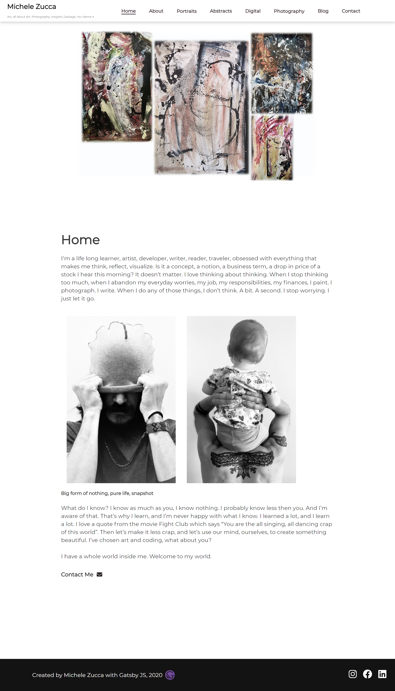
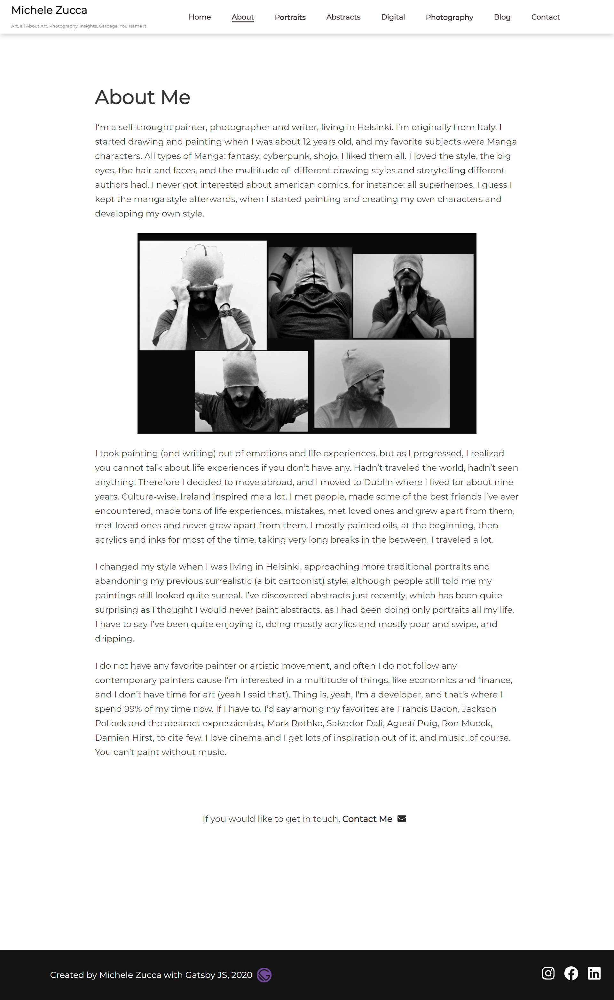
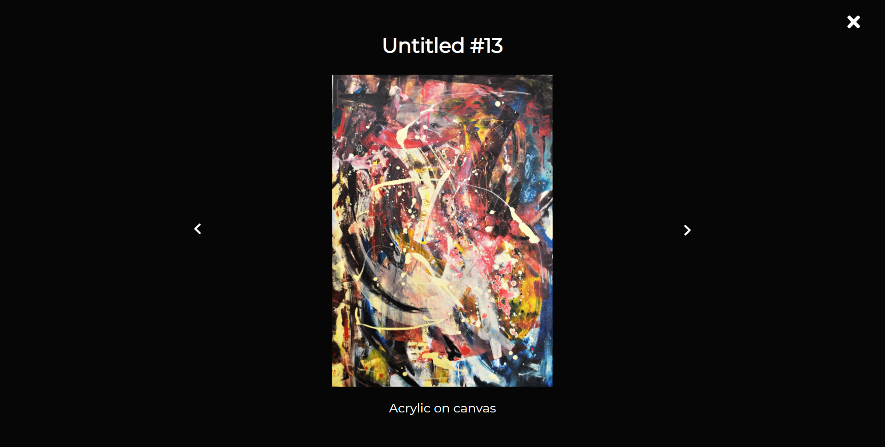
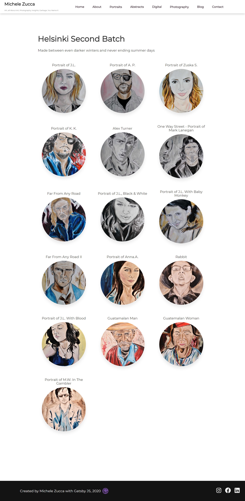
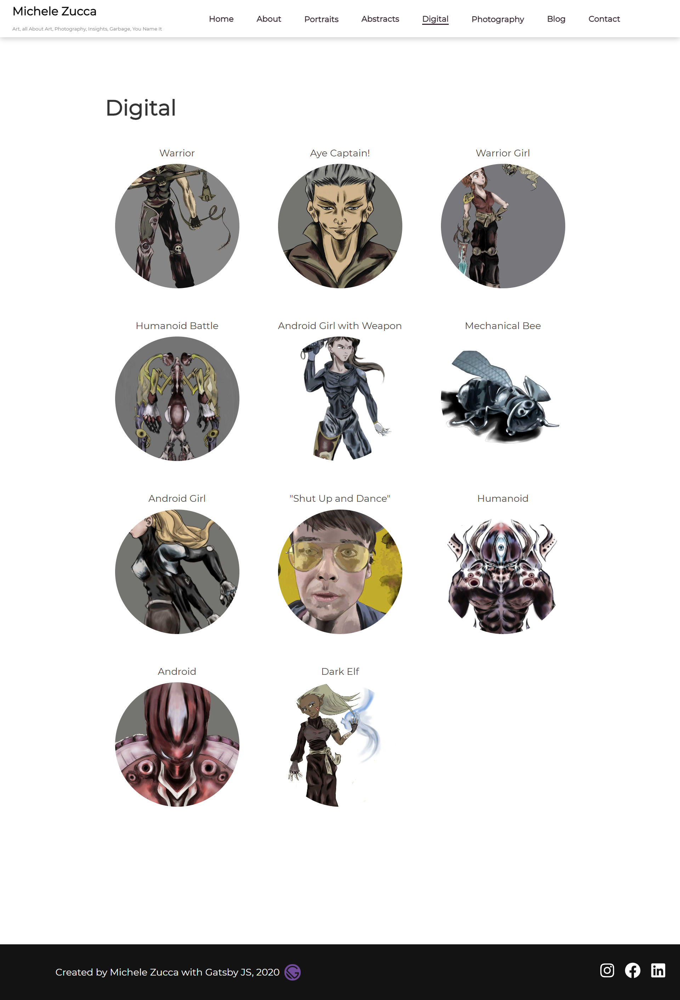
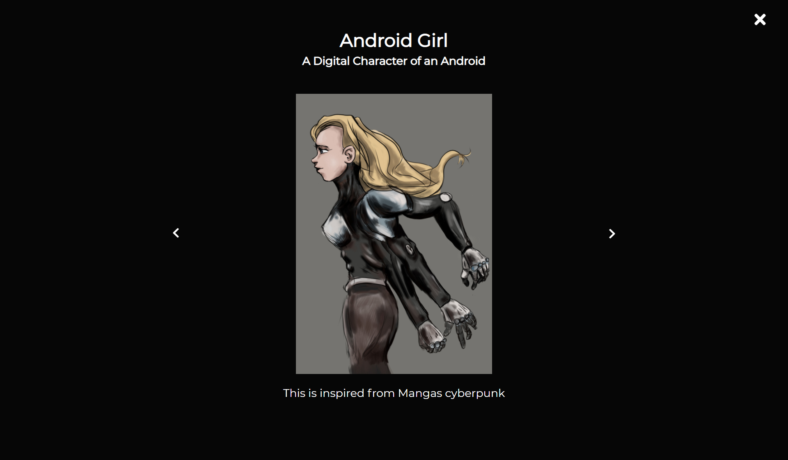
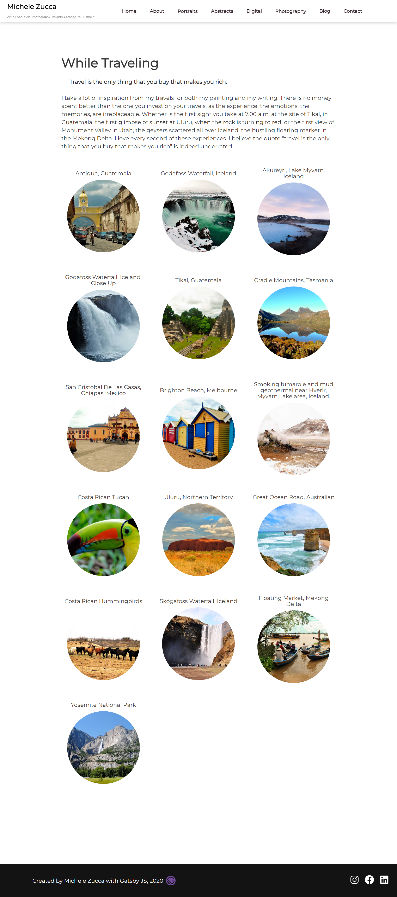
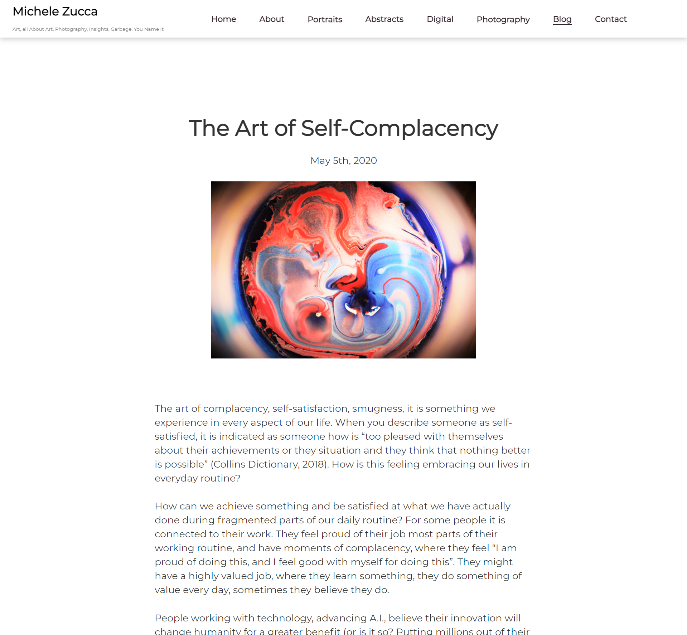
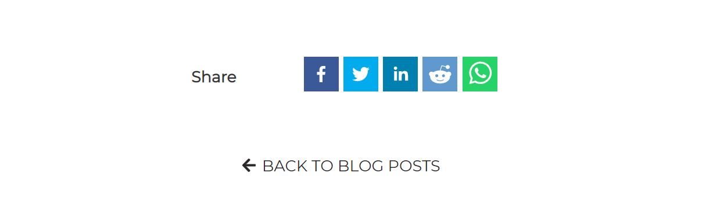
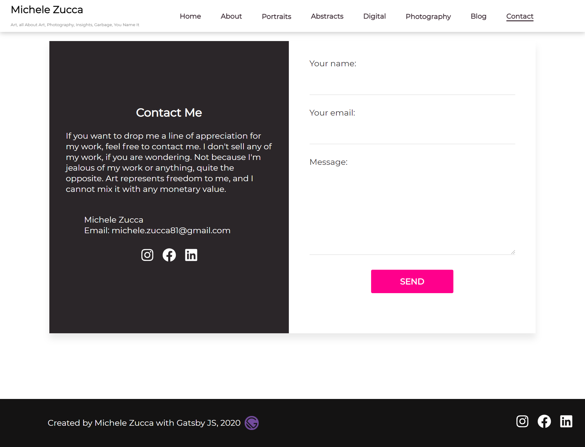

# Michele Zucca Art Website

As an art fanatic, art is one of my main passions aside from programming. I did have previously built a Wordpress website when I didn't know how to code, which I later substituted with this website built on Gatsby, GraphQL and Contentful. The website features a section about me and my porfolio as an artist, with different subsections based on my type of work: abstracts, portraits, photography, a blog section and a contact form. Art has been one of my main passions since I was a kid, and it is something I have always been doing a form of expression within the years.

# Table of contents:

- [Tech Stack Used](#tech-stack-used)
- [Home](#home)
- [About Me](#about-me)
- [Abstracts](#abstracts)
- [Portraits](#portraits)
- [Photography](#exchanges)
- [Blog](#blog)
- [Contact](#contact)
- [CMS & Content](#cms-and-content)
- [Deployment](#deployment)

# Tech Stack Used
- Gatsby Js
- React Js
- JavaScript
- GraphQL
- Contentful
- Netlify Forms
- Sass

## Home

## About Me

## Abstracts

## Portraits

## Digital

## Photography

## Blog

The blog section features posts on my thoughts about art in general. Users can share my posts via Facebook, Whatsapp, Linkedin, Reddit or Twitter. The sharing components come from a React library called react-share

## Contact

Users viewing my website can contact me using this form, which is built using Netflify forms. The form is connected directly through Netlify and a notification is received on my provided email upon user contact.

## CMS

The portfolio website uses Contentful as headless CMS. When adding data, there is no need to access the codebase as all the content is dynamic. Once new content is added through Contentful, such as pictures of new paintings, update on about section, descriptions, or a new blog post, Gatsby fetches the data with GraphQL and the new content is displayed on the website. There is no need to manually trigger a new deploy on Netlify as the CMS is connected to Netlify via Webhooks, therefore automatic deploys are generated once the content is published.

## Deployment

The app is deployed on Netlify and the demo can be found at the following link: https://michelezucca-art.netlify.app/

